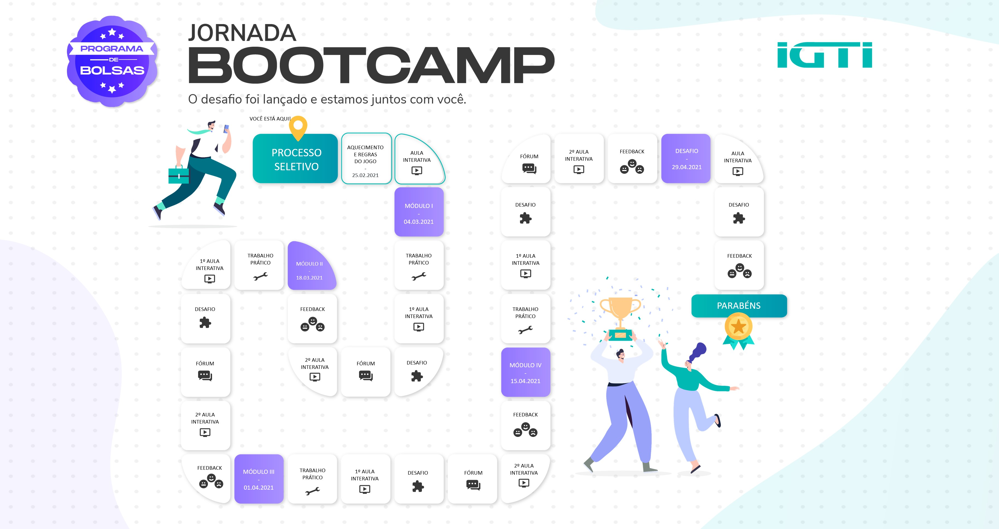

# IGTI - Bootcamp Engenheiro de Dados

### Repositorio responsável pelos execicios do Bootcamp Engenheiro de Dados

### https://www.igti.com.br/custom/engenharia-de-dados/

 

# Material

### **ENADE**
- [01 Enade Extração](./01_enade_extracao.ipynb)
- [02 Enade Transformação](./02_enade_transformacao.ipynb)

### **TWITTER**
- [Get Tweets](./03_get_tweets.py)
- [03 Extract Analyze Tweets.ipynb](./03_extract_analyze_tweets.ipynb)

### **DOCKER**
- [Airflow](./Docker/README.md)

# Trabalhos
- [Modulo 1](./Trabalho-Modulo-01/README.md)

 

# Profissional de Engenharia de Dados
Habilite-se para trabalhar com Engenharia de Dados. Conheça as tecnologias e métodos usados na construção do pipeline de dados (data flow) que envolvem processos de coleta, preparação, processamento, armazenamento e acesso a dados. Desenvolva soluções que evolvam uso analítico ou operacional de dados, utilizando plataformas e arquiteturas escaláveis e robustas, garantindo a disponibilidade, segurança, qualidade e confiabilidade dos dados. Aprenda projetar e implementar repositórios de dados utilizando diferentes tecnologias como bancos de dados relacionais, NoSQL, sistemas de arquivos.

 

# Jornada Bootcamp
